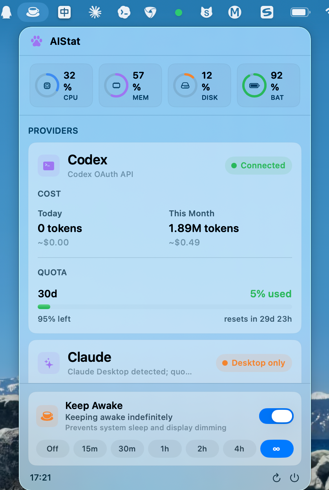

# AIStat

**A compact macOS menu bar dashboard for AI coding usage, system status, and Keep Awake.**

AIStat brings Codex / Claude usage quota, local token & cost, system health, and a Keep Awake switch together in one tidy menu bar panel — so you can track AI coding budget, keep your Mac running, and glance at device status without juggling multiple apps.

<p align="center">
  <a href="https://github.com/Andrew-liu/AIStat/releases/latest"></a>
  
  
  <a href="LICENSE"></a>
</p>

<p align="center">
  <a href="https://github.com/Andrew-liu/AIStat/releases/latest">Download</a> ·
  <a href="#features">Features</a> ·
  <a href="#data--privacy">Data &amp; Privacy</a> ·
  <a href="#build-from-source">Build from Source</a>
</p>

<p align="center">
  <a href="README.md">简体中文</a> | <strong>English</strong>
</p>

<p align="center">
  
</p>

## Why AIStat

| | |
| --- | --- |
| **AI budget at a glance** | Codex and Claude quota, token usage, and cost in one menu bar panel. |
| **Keep your Mac awake** | Prevent idle and display sleep with one click, from 15 minutes to forever. |
| **Local-first** | Usage is read from local credentials, CLI tools, and logs. No custom backend. |

Built for macOS developers who spend long sessions in Claude Code and Codex and want their AI budget and system status always one click away.

## Features

| Module | Capability |
| --- | --- |
| **AI Usage** | Codex quota with token/cost overview; Claude quota when local data sources are available; last-known quota cache to avoid blank states on temporary refresh failures. |
| **System Status** | CPU, memory, disk, and battery overview; disk read/write speed; clickable detail pages. |
| **Keep Awake** | Off, 15m, 30m, 1h, 2h, 4h, or forever; prevents idle and display sleep; menu bar icon follows the awake state. |

Built with SwiftUI `MenuBarExtra` and a modular per-metric architecture for easy extension to more providers.

## Install

1. Download the latest `.dmg` from [Releases](https://github.com/Andrew-liu/AIStat/releases/latest).
2. Drag `AIStat.app` into `/Applications`.
3. Launch AIStat from Applications.

> The DMG is not Apple-notarized yet. On first launch, right-click the app and choose **Open** to bypass Gatekeeper.

## Data & Privacy

AIStat is local-first. It never uploads usage data to a custom backend, and avoids automatic Claude Keychain access to prevent password prompts.

| Data | Source |
| --- | --- |
| System metrics | Read locally on your Mac. |
| Codex token / cost | Scanned from local Codex session logs. |
| Claude token / cost | Scanned from local Claude Code logs when present. |
| Codex quota | Codex OAuth usage API `https://chatgpt.com/backend-api/wham/usage`. |
| Claude quota | Claude OAuth usage API `https://api.anthropic.com/api/oauth/usage`. |

Network access only occurs when provider quota APIs are used.

## Requirements

- macOS 14 or newer recommended
- Xcode 16 or newer recommended
- Swift 5.9+
- Optional data sources:
  - Codex app / CLI with `~/.codex/auth.json`
  - Claude Code CLI or Claude OAuth credentials file

## Build from Source

```bash
git clone https://github.com/Andrew-liu/AIStat.git
cd AIStat
open AIStat.xcodeproj
```

Select the `AIStat` scheme and run from Xcode. Or build from the command line:

```bash
xcodebuild \
  -project AIStat.xcodeproj \
  -scheme AIStat \
  -configuration Debug \
  -derivedDataPath .derivedData \
  build
```

Create a local unsigned DMG:

```bash
./scripts/package_dmg.sh   # output: release/AIStat-<version>.dmg
```

Signed DMG, if you have an Apple Developer certificate:

```bash
SIGNING_IDENTITY="Developer ID Application: Your Name (TEAMID)" \
DEVELOPMENT_TEAM="TEAMID" \
./scripts/package_dmg.sh
```

Notarize a signed DMG:

```bash
APPLE_ID="you@example.com" \
TEAM_ID="TEAMID" \
APP_SPECIFIC_PASSWORD="xxxx-xxxx-xxxx-xxxx" \
./scripts/notarize_dmg.sh release/AIStat-<version>.dmg
```

## Tech Stack

`SwiftUI` · `MenuBarExtra` · `IOKit` · `pmset` · `caffeinate` · `xcodebuild`

## Data Source Notes

**Codex** — AIStat reads in this order: Codex OAuth usage API from `~/.codex/auth.json` → Codex CLI RPC via `codex app-server` → local Codex session logs → last-known quota cache. If Codex returns only a 30-day window, AIStat shows `30d` rather than forcing `5h` or `Week`.

**Claude** — AIStat avoids automatic Keychain prompts. Quota can be read from a Claude OAuth credentials file → Claude Code CLI `/usage` → last-known quota cache. Claude Desktop-only installations may show `Desktop only`, because reading Claude Desktop cookies requires Keychain access.

## Release Checklist

1. Update `MARKETING_VERSION` and `CURRENT_PROJECT_VERSION` in Xcode.
2. Run `./scripts/package_dmg.sh`.
3. Sign and notarize the DMG if distributing outside source builds.
4. Tag the release: `git tag v1.0.0 && git push origin v1.0.0`.
5. Upload the generated DMG to GitHub Releases.

## License

MIT © 2026 Andrew-liu. See [LICENSE](LICENSE).
